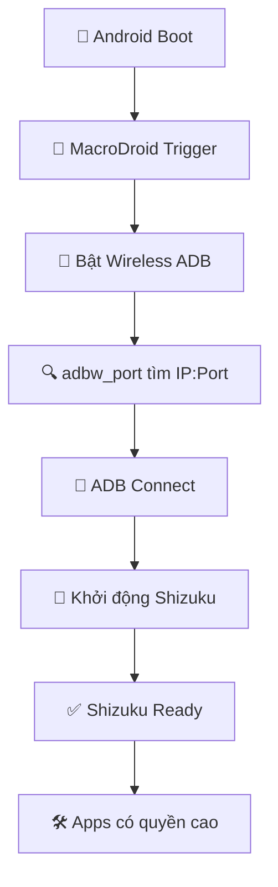

# 🚀 Shizuku Auto-Start (Non-Root)

Hệ thống tự động khởi động Shizuku trên Android không cần root, sử dụng ADB wireless debugging.

## 📋 Yêu cầu

- **Android 11+** với Developer Options
- **Termux** từ F-Droid với `allow-external-apps=true`
- **MacroDroid** (hoặc ứng dụng automation tương tự)
- **Shizuku** từ Play Store hoặc GitHub
- **WiFi** (để ADB wireless hoạt động)

## 📁 Cấu trúc file

```
ADB-and-Shizuku-AutoStart/
├── copy.sh                           # 🛠️ Script cài đặt chính
├── adbw_port                         # 🔍 Tool tìm ADB port
├── adbw_port_arm.bin                 # Binary ARM 32-bit
├── adbw_port_arm64.bin               # Binary ARM 64-bit
├── debug_shizuku.sh                  # 🔧 Tool debug và chẩn đoán
├── Auto_start_Shizuku_on_boot_(non-root).macro  # 📱 Macro MacroDroid
└── README.md                         # 📖 Tài liệu hướng dẫn
```

## ⚠️ File quan trọng thiếu

**`rish_shizuku.dex`** cần được export thủ công từ ứng dụng Shizuku ra bộ nhớ ngoài của điện thoại.

## 🚀 Hướng dẫn cài đặt

### 1. Chuẩn bị môi trường

```bash
# Trong Termux
pkg update && pkg upgrade
pkg install android-tools
termux-setup-storage

# QUAN TRỌNG: Bật external apps (cần thiết cho adbw_port)
echo "allow-external-apps=true" >> ~/.termux/termux.properties

# Khởi động lại Termux app hoàn toàn (đóng và mở lại)
```

### 2. Thiết lập file

```bash
# Tạo thư mục làm việc
mkdir ~/shizuku-autostart
cd ~/shizuku-autostart

# Copy tất cả file vào đây, bao gồm rish_shizuku.dex
```

### 3. Chạy cài đặt

```bash
chmod +x copy.sh
./copy.sh
```

### 4. Debug (nếu cần)

```bash
chmod +x debug_shizuku.sh
./debug_shizuku.sh
```

## 🔧 Các lệnh được tạo

Sau khi cài đặt thành công:

- **`shizuku`** - Khởi động Shizuku thủ công
- **`rish`** - Shell với quyền cao qua Shizuku

## 🤖 Thiết lập MacroDroid

1. Import file `.macro` vào MacroDroid
2. Cấp các quyền cần thiết:
   - Accessibility Service
   - System Settings access
   - Termux integration

## ✨ Tính năng mới trong phiên bản cải tiến

### 🛡️ Xử lý lỗi nâng cao
- ✅ Kiểm tra tồn tại tất cả file cần thiết
- ✅ Validate quyền ghi vào thư mục
- ✅ Tự động cài ADB nếu thiếu
- ✅ Xác minh Shizuku app đã cài đặt

### 🎨 Trải nghiệm người dùng tốt hơn
- ✅ Output có màu sắc (THÔNG TIN/THÀNH CÔNG/LỖI/CẢNH BÁO)
- ✅ Thông báo tiến trình chi tiết bằng tiếng Việt
- ✅ Hướng dẫn troubleshooting dễ hiểu

### 🧠 Quản lý đường dẫn thông minh
- ✅ Tự động tìm `adbw_port` ở nhiều vị trí
- ✅ Không phụ thuộc working directory
- ✅ Smart DEX file resolution (không copy không cần thiết)
- ✅ Robust path resolution

### 🔍 Debug nâng cao
- ✅ Tool debug tổng hợp (`debug_shizuku.sh`)
- ✅ Kiểm tra trạng thái hệ thống
- ✅ Network connectivity test
- ✅ Chẩn đoán toàn diện bằng tiếng Việt

## 🐛 Troubleshooting

### Chạy tool debug
```bash
./debug_shizuku.sh
```

### Các lỗi thường gặp

**❌ "Không tìm thấy rish_shizuku.dex"**
```bash
# Export file từ app Shizuku và đặt cùng thư mục với copy.sh
```

**❌ "Không tìm thấy IP hoặc port"**
```bash
# 1. Bật Wireless Debugging
# 2. Ghép nối thiết bị lần đầu
# 3. Đảm bảo cùng mạng WiFi
```

**❌ "Ứng dụng Shizuku chưa được cài đặt"**
```bash
# Cài Shizuku từ Play Store hoặc GitHub
```

**❌ "Permission denied" khi chạy adbw_port**
```bash
# QUAN TRỌNG: Bật external apps trong Termux trước
echo "allow-external-apps=true" >> ~/.termux/termux.properties

# Khởi động lại Termux app hoàn toàn (đóng và mở lại)

# Sau đó chạy lại script cài đặt
./copy.sh
```

### Reset hoàn toàn
```bash
# Xóa các file đã tạo
rm -f $PREFIX/bin/shizuku $PREFIX/bin/rish ~/rish_shizuku.dex

# Chạy lại cài đặt
./copy.sh
```

## 🔗 Links hữu ích

- **Shizuku GitHub**: https://github.com/RikkaApps/Shizuku
- **Hướng dẫn thiết lập**: https://github.com/RikkaApps/Shizuku/discussions/462
- **rish_shizuku.dex**

## 💡 Cách hoạt động


```mermaid
graph TD
    A[📱 Android Boot] --> B[🤖 MacroDroid Trigger]
    B --> C[📡 Bật Wireless ADB]  
    C --> D[🔍 adbw_port tìm IP:Port]
    D --> E[🔗 ADB Connect]
    E --> F[🚀 Khởi động Shizuku]
    F --> G[✅ Shizuku Ready]
    G --> H[🛠️ Apps có quyền cao]
```

## 📞 Hỗ trợ

Nếu gặp vấn đề:
1. Chạy `./debug_shizuku.sh` để kiểm tra toàn diện
2. Đọc output của tool debug với thông báo tiếng Việt
3. Kiểm tra các requirements
4. Reset và cài lại nếu cần

---

**🎯 Mục tiêu**: Shizuku tự động khởi động sau mỗi lần reboot mà không cần can thiệp thủ công! 